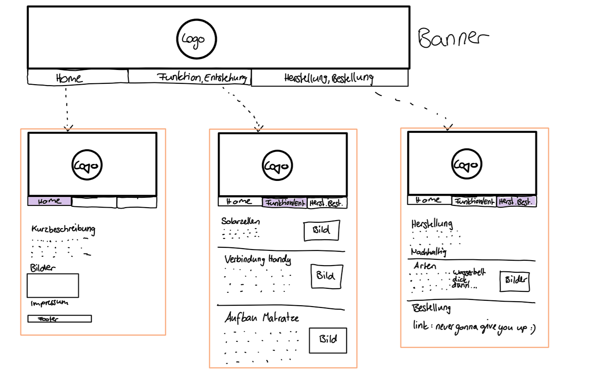
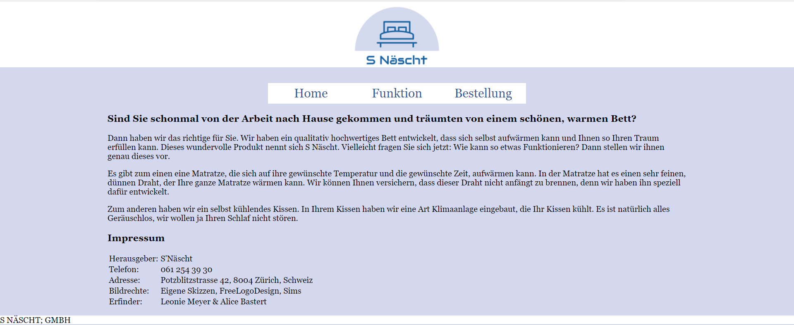
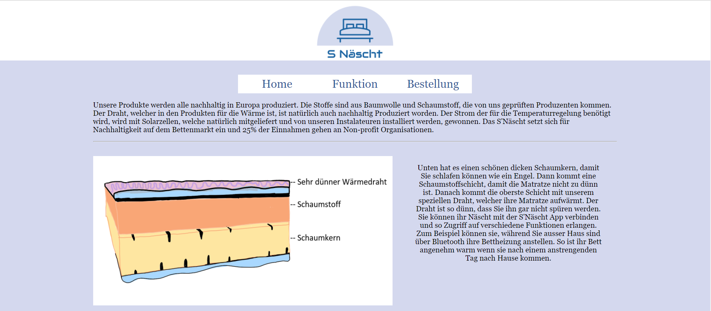
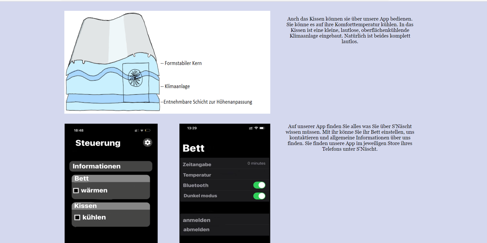
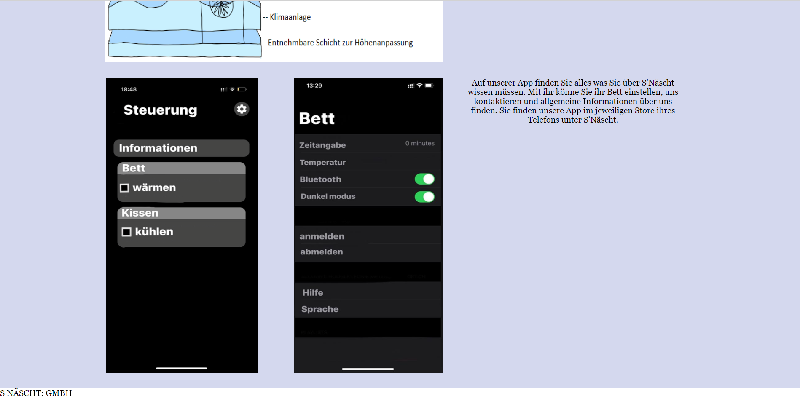
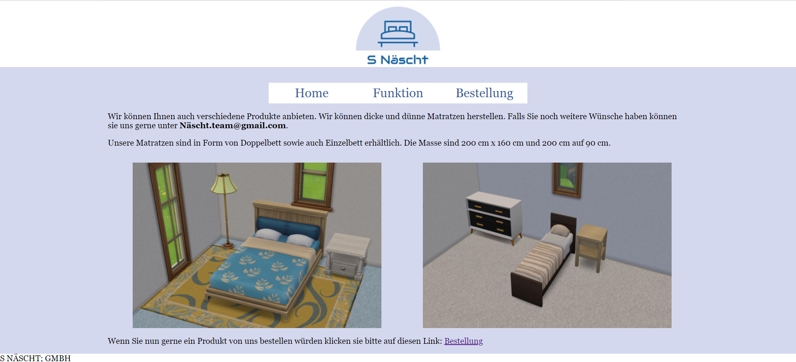

**S Näscht**
Kurzbeschreibung der Webseite. Was ist der Inhalt?
Ein selbstwärmendes/selbstkühlendes Bett das über eine App mit dem Handy verbunden ist. So kann man es anstellen wenn man auf dem Weg nach Hause ist. Das Kissen hat einen seperaten Temperaturpegel, denn man auch einstellen kann. So kann man zum Beispiel ein warmes Bett und ein kühles Kissen haben.  
## Projektplan

 Geplant war eine Website mit drei Unterseiten zu erstellen, welche unser Produkt vorstellt und die "Besucher" überzeugt unser Produkt zu kaufen. 
 Wir wollten auf jeder Unterseite oben einen Banner, welcher unser Logo zeigt. Auch wollten wir den Hintergrund der Links ändern, wenn man mit der Maus darauf kommt.
 Ausserdem haben wir versucht mit mehreren Bildern zu arbeiten, um unser Produkt veranschaulichen zu können.

### Impressum

Skizze mit Beschreibung.

usw...

## Zeitplan

Zeitplan mit mindestens wöchentlichen Meilensteinen. Wann setzt wer etwas um?

| 21.05.2021 | S Näscht | Selbstwärmendes Bett |
| --- | --- | --- |
| 10.05.2021 | Alice Bastert, Leonie Meyer | Skizzen, Banner, evt. Unterseiten erstellen |
| Auffahrt | Alice Bastert, Leonie Meyer | Home Page, grobes Layout |
| 17.05.2021 | Alice Bastert, Leonie Meyer | fertig & Feinschliff |

## Umsetzung

Wir haben als erstes die verschiedenen Unterseiten erstellt. Währenddessen wurde auch die Skizze zu unserer Website gezeichnet. 
Während jemand von uns die eine Unterseite erstellt hat, hat die andere angefangen die Bilder unseres Produktes zu zeichnen.
Als wir dann das grobe Layout hatten, kamen noch die Texte dazu. 
Als es dann zur ersten Komplikation gekommen ist (der Footer war mitten in der Seite)konnten wir es aber ziemlich schnell lösen. Später gab es dann noch ein paar Probleme bei der Unterseite "Funktion", nämlich waren alle Bilder überkreuzt und die Texte waren darunter. Als wir dann jedoch jeweils Klassen zu den jeweiligen Elementen erstellt und diese dann mit dem CSS gestylet haben, war das Problem schnell gelöst.
Wir haben uns nicht ganz an unseren Plan gehalten, aber uns kamen dann wärend des Progresses noch andere Ideen, wie zum Beispiel den Hintergrund unserer Website blau zu färben.

### Hauptseite

Allgemeine Informationen und Impressum.

Wir haben unsere Hauptseite relativ schlicht gehalten, damit einem nicht zu viel ins Auge sticht.

### Funktionalität

Funktionalität von Matratze, Kissen und App.

In der zweiten Unterseite (Funktion) stellen wir unser Produkt genauer vor und visualisieren auch, wie die einzelnen Produkte aufgebaut sind. 
Es wird Ihnen auch die App vorgestellt, wie sie das Produkt steuern können

### Bestellung

Link zu Bestellung und Bilder Matratzenangebot.

Auf der dritten und letzten Unterseite finden sie noch unsere Email Adresse und sie können unser Produkt über einen Link bestellen.

## Zusammenfassung

Wir haben uns relativ gut an unseren Plan gehalten, Zwieschendurch hat es einige Komplikationen gegeben, die wir dann aber gemeistert haben. Im Verlauf des Erstellens unserer Website sind uns noch einige neue Ideen eingefallen (z.B Aufbau von App und Kissen) welche wir dann hinzugefügt haben. Ein paar Sachen haben wir dann auch wieder verworfen (z.B die verschiedenen Matratzenarten). Von der Zeit her waren wir eigentlich recht gut dran, waren dann aber doch um die Verlängerung sehr froh. 

